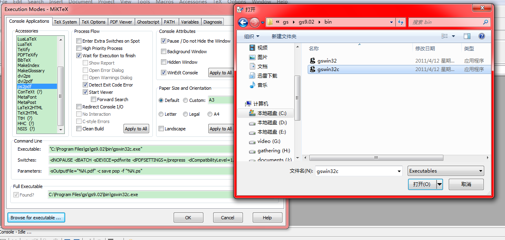

When uploading papers to EDAS, you might encounter a problem which is called as “Not All Fonts are Embedded”. Today, I'll give you a relatively easy and convenient solution.

## Tools

[GS x86 for 32-bit Windows](http://pan.baidu.com/s/1hq701wC) 

[GS x64 for 64-bit Windows](http://pan.baidu.com/s/1pJDXLVl)

## Steps

### Download and Install The Proper GS (_i.e._, GS x86 or GS x64)

**Note that**, in the following steps, I will assume the GS is installed at "C:/Program Files/gs"!

### Change Configuration of WinEdit

1. Locate the settings of "ps2pdf": Winedit -> Option -> Exectution Modes -> ps2pdf, as shown in the following figure,

    

2. Click "Browse for executable..." at the left-bottom, and select the "gswin32c.exe" at "C:/Program Files/gs/gs9.02/bin/"

    

3. Fill "Switches" entry with the following setting (if it was not empty before filling, then just replace the original one),

        -dNOPAUSE -dBATCH -sDEVICE=pdfwrite -dPDFSETTINGS=/prepress  -dCompatibilityLevel=1.4 -dSubsetFonts=true -dEmbedAllFonts=true

    as shown in the following figure,

    

4. Replace the original setting in "Parameters" entry with the following one,

        -sOutputFile="%N.pdf" -c save pop -f "%N.ps"

    as shown in the following figure,

    

5. Click "OK"

