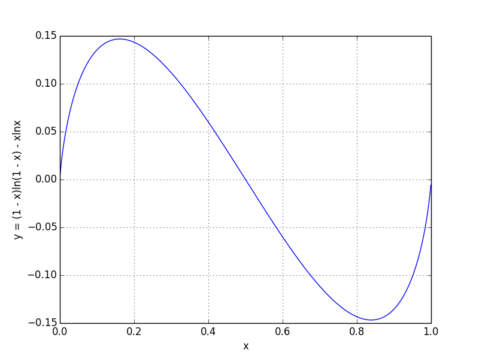

* auto-gen TOC:
{:toc}

## Hashing

### Basic Concepts

**Definition 1: [Simple Uniform Hashing]** A randomized algorithm $$H$$ for constructing hash functions $$h: U \rightarrow \{1,...,M\}$$ is called as simple uniform hashing, if given any element is $$U$$ is equally likely to hash into any of the $$M$$ slots.

**Definition 1: [Universal Hashing]** A randomized algorithm $$H$$ for constructing hash functions $$h: U \rightarrow \{1,...,M\}$$ is called universal, if for any $$x \neq y$$ in $$U$$, we have,

$$
pr_{h \leftarrow H}[h(x) = h(y)] \le \frac{1}{M},
$$

We also say that a set H is a **universal hash function family** if randomly choosing $$h \in H$$ produces a universal hashing.

### Performances

## 1. Bloom Filter

*Bloom filter@Bloom1970*{: .cite} is a space-efficient probabilistic data structure. It is used for membership query, _i.e.,_ answering the question whether an element $$y$$ belongs to a given set $$S$$.
However, bloom filter has a so-call false positive issue, where it may answer "YES" when $$y \notin S$$. 

### 1.1 Algorithmic Description

In standard bloom filter, the baseline data structure is a [bit array](https://en.wikipedia.org/wiki/Bit_array) of $$m$$ bits with $$k \ge 1$$ **independent** hash functions. In this following description, we will use $$B[1..m]$$ to denote the bit array, and $$h_1, h_2, ..., h_k$$ to represent the $$k$$ hash functions.

At the very beginning, all of its bits are set to $$0$$. Standard bloom filter supports the following two operations:

1. **INSERT**: the following pseudo-code inserts all elements of set $$S$$ into the bloom filter. 

    ~~~python
    for x in S:
        for h in hash_functions.values():
            B[h(x)] = 1
    ~~~
    {: .special}

2. **QUERY**: the following pseudo-code queries whether $$y \in S$$. 
   
    ~~~python
    answer = True
    for h in hash_functions.values():
        answer &= B[h(y)] == 1
    ~~~
    {: .special}

### 1.2 False Positive Analysis

From _Section 1.1_, you might notice that, for an element $$y \notin S$$, the corresponding $$k$$ bits (_i.e.,_ $$h_1(y), h_2(y), ..., h_3(y)$$) might be all 1's, therefore $$y$$ might be falsely claimed to be in the set $$S$$. The phenomenon is so-called **false positive**. In this subsection, we want to analyze the probability of this phenomenon, which is usually called as **false positive probability**. 

Assume that the bloom filter has $$m$$ bits and $$k$$ independent hash functions, and $$\mid S \mid = n$$. 

First of all, for any given bit, the probability that after inserting all the elements of $$S$$, its value is still $$0$$ is,

$$
\left(1 - \frac{1}{m}\right)^{kn} = \left(1 -\frac{1}{m}\right)^{kn},
\label{eq:prob0}
$$

As $$\lim_{m \rightarrow \infty} \left(1 - \frac{1}{m}\right)^m = e^{-1}$$, when $$m, n$$ are large enough, the probability in Eqn. $$\eqref{eq:prob0}$$ can be approximated (well) by using $$e^{-kn/m}$$. Therefore, the false positive probability can be expressed as,

$$
\begin{aligned}
p_{fpp} &= (1 - p_0)^k \\
        &= (1 - e^{-kn.m})^k
\end{aligned}
$$

**Case 1**: given $$n$$ and $$m$$, finding optimal $$k$$.

Let $$f(k) = p_{fpp} = (1 - e^{-kn/m})^k$$, and 

$$
g(k) = \ln f(k) = k \ln (1 - e^{-kn/m})
$$

Hence, we have,

$$
\frac{d g}{d k} = \ln (1 - e^{-kn/m}) + \frac{kn}{m} \frac{e^{-kn/m}}{1 - e^{-kn/m}}
$$

Let $$x = e^{-kn/m}$$, then,

$$
\begin{aligned}
\frac{d g}{d k} &= \ln (1 - x) - \ln x \frac{x}{1 - x}\\
                &= \frac{1}{1 - x} \left((1-x)\ln (1-x) - x\ln x\right)
\end{aligned}
$$

It is easy to figure out, when $$x = \frac{1}{2}$$ (_i.e.,_ $$k = \frac{m}{n}\ln 2$$), $$\frac{d g}{d k} = 0$$. To check whether $$k = \frac{m}{n}\ln 2$$ is the minimal point and the only extreme point, we can draw the curve of $$y = (1-x)\ln (1-x) - x\ln x$$ (which is shown in the following figure).

From the above curve, we can verify that $$k = \frac{m}{n}\ln 2$$ is the only extreme point and it is the minimal point, therefore, it is the minimum point. Therefore, the optimal $$k$$ is,

$$
\begin{equation}
k = \frac{m}{n}\ln 2
\end{equation}
$$

**References**{: .reference}

