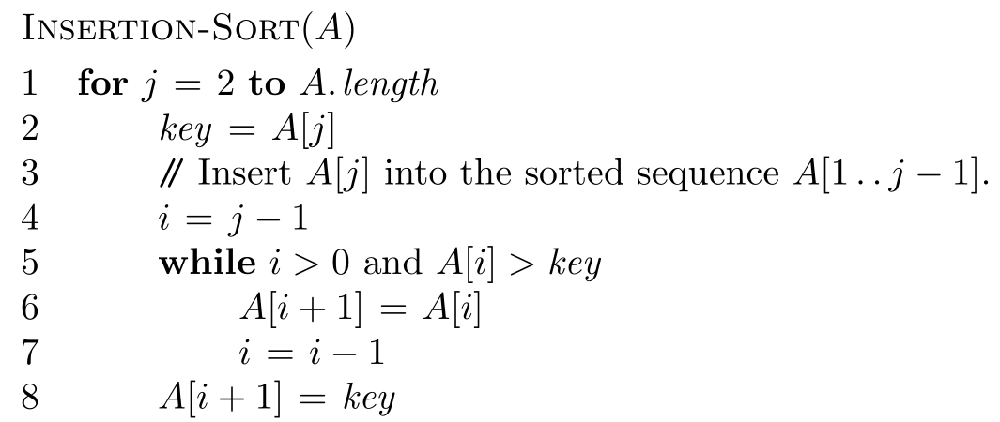

## 1. Algorithms Packet

### 1.1. clrscode3e Package
_clrscode3e_ package was developed and maintained by Professor [Thomas H. Cormen](http://www.cs.dartmouth.edu/~thc/). As indicated by the name of the package, it was designed to duplicate the pseudocode displaying style in the textbook, Introduction of Algorithms (Third edition), by Cormen, Leiserson, Rivest, and Stein (CLRS 3/e). More details about the package, you can refer to [its documentation](http://www.cs.dartmouth.edu/~thc/clrscode/clrscode3e.pdf).

#### Setup
**STEP 1**: download the [_clrscode3e_ package](http://www.cs.dartmouth.edu/~thc/clrscode/clrscode3e.sty).

**STEP 2**: In the header part of your TEX file, please include the following sentence.

    \usepackage{clrscode3e}

**STEP 3**: Use the syntax of this package to type your pseudocode. 

#### An Example

The following gives an example of how pseudocode generated by _clrscode3e_ package looks like.

The source code is as follows (do not forget to including _clrscode3e_ package in the header).

~~~
\begin{codebox}
\Procname{$\proc{Insertion-Sort}(A)$}
\li \For $j \gets 2$ \To $\attrib{A}{length}$
\li \Do
$\id{key} \gets A[j]$
\li \Comment Insert $A[j]$ into the sorted sequence
$A[1 \twodots j-1]$.
\li $i \gets j-1$
\li \While $i > 0$ and $A[i] > \id{key}$
\li \Do
$A[i+1] \gets A[i]$
\li $i \gets i-1$
\End
\li $A[i+1] \gets \id{key}$
\End
\end{codebox}
~~~

The generated pseudocode looks like.

