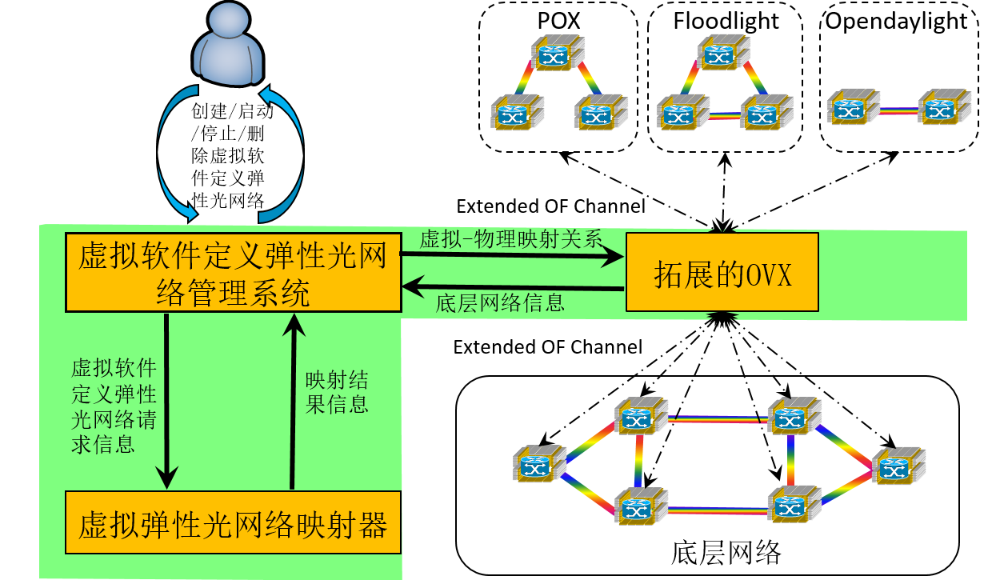

## Descriptions

### System Overview

The above figure shows the overview of our network virtualization system. From it, we can see there are three major modules in our system.

* Virtual Software-Defined Virtual Network Management Module

    > A Web GUI for users (or customers) to create and Manage their virtual networks continently. 
    > Implementation
        + Front-end: [bootstrap](http://getbootstrap.com/)
        + Back-end: [django](https://www.djangoproject.com/)
    
    > More details you can refer to the video demo in the following part and [my master thesis](../attachments/master_thesis.pdf)
 
* Network Hyper-visor (Extended [OpenVirteX](http://ovx.onlab.us/), E-OVX for short)

    > A openflow-based network hyper-visor supporting for network virtualization
    > It is based on [OpenVirteX](http://ovx.onlab.us/), we did protocol extension on it (i.e., making it support for elastic optical network)
    > More details you can refer to the official web of [OpenVirteX](http://ovx.onlab.us/)
    
* Virtual Network Embedder 

    > The module to conduct virtual network embedding, which is one of the major challenges in network virtualization
    > Motivations to separating it from Network Hyper-visor:
        + Easily upgrade
        + Easily debug
        

### Major Principle 

* [Topology Virtualization](https://gtvault-my.sharepoint.com/personal/lgong30_gatech_edu/_layouts/15/guestaccess.aspx?guestaccesstoken=DI6XOcLeMJwAoTt%2beQm05XvVELr99w%2fjiEcAjTjGs2k%3d&docid=046e8e6440fea4cd4924f3400f32818f2)
* [Address Virtualization](https://gtvault-my.sharepoint.com/personal/lgong30_gatech_edu/_layouts/15/WopiFrame.aspx?guestaccesstoken=I3Mw8OHJcfBxwjtso7tZekf0gxEBroKmog%2fdvJHOGcA%3d&docid=00b26142080bd44c698eb7dcf3378fc72&expiration=2016%2f03%2f03+19%3a50%3a22&action=view)

More details, you can refer to [OpenVirteX official web](http://ovx.onlab.us/) or [my master thesis](../attachments/master_thesis.pdf)

### A Video Demo 

The following video shows how a user applies our network virtualization platform to create and manage their virtual networks.

*../attachments/demo.mp4*{: .video}

Model details your can refer to my [defense ppt](../attachments/defense_ppt.pptx) and the system part of [my master thesis](../attachments/master_thesis.pdf).

