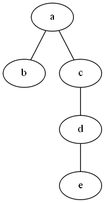
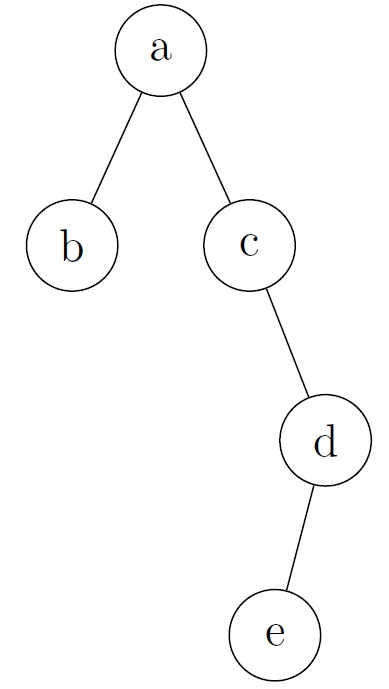

In this post, we will talk about easy ways to draw binary trees. 

## Binary Trees with Graphviz

This first method is to use the open source Graph Virtualization Software - [Graphviz](http://www.graphviz.org/). 

Let's start an example of drawing a binary tree as shown in the following figure.

First of all, create a file and then type in the following content, and save it as **bt.dot**.

~~~dot
graph{
    a -- b;
    a -- c;
    c -- d;
    d -- e;
}
~~~

Then, **open a terminal** and use **cd** command to come to the directory where **bt.dot** locates, then **type in** the following command in the terminal, and **run** it.

~~~shell
dot -Tpng bt.dot -o bt.png
~~~

After running the command, you will find **bt.png** in the same directory as **bt.dot**. This figure is shown below. (Note that, it seems that Graphviz on Mac does not support png yet, so if you use Mac to go through this example, we can change **png** to **ps** or any other types that are supported.)

{: style="float:center,width=40%"}

Of course, Graphviz is much more powerful than that, if you are interested you can refer to the following tutorials:

* [Drawing graphs with dot](http://www.graphviz.org/pdf/dotguide.pdf)  
* [Drawing Graphs using Dot and Graphviz](http://www.tonyballantyne.com/graphs.html)

However, from the above simple example, you might already notice that, Graphviz treats left child and right child indistinguishably. So if you want to distinguish between them in your case, it would not be a very good solution. There is no doubt that Graphviz provides you the power to customize the layout or even location of each vertex, however, it would be inconvenient if you have to specify the location for each vertex. And I feel surprised that Graphviz does not provide any easy ways to achieve this goal. On [Stackoverflow](http://stackoverflow.com/questions/10902745/enforcing-horizontal-node-ordering-in-a-dot-tree), someone provides a solution to achieve this goal (I have not tested the solution, I am not sure whether it works or not), but the solution is not perfect. 

## Binary Tree with Tikz

[Tikz-qtree](http://mirror.unl.edu/ctan/graphics/pgf/contrib/tikz-qtree/tikz-qtree-manual.pdf) provides a simple solution to draw binary tree in which left and right children are distinguishable.

Let's draw the same binary search as in the above example.

First of all create a file and type in the following content and then save it as **bt.tex** (note that, the original Latex codes are copied from [Stackexcahnge](http://tex.stackexchange.com/questions/47469/how-do-i-make-an-unbalanced-binary-tree))

~~~Latex
\documentclass{article}
\usepackage{tikz-qtree}
\begin{document}
\tikzset{every tree node/.style={minimum width=2em,draw,circle},
         blank/.style={draw=none},
         edge from parent/.style=
         {draw,edge from parent path={(\tikzparentnode) -- (\tikzchildnode)}},
         level distance=1.5cm}
\begin{tikzpicture}
\Tree
[.a     
    [.b ]
    [.c 
    \edge[blank]; \node[blank]{};
    \edge[]; [.d
             \edge[]; {e}
             \edge[blank]; \node[blank]{};
         ]
    ]
]
\end{tikzpicture}
\end{document}
~~~

Then, compile **bt.tex**. The following shows what the binary tree looks like.

{: style="float:center,width=40%"}

The following give some tutorials on how to draw beautiful figures with Tikz:

* [TikZ and PGF with a large number of examples](http://www.texample.net/tikz/)
* [pgf – Create PostScript and PDF graphics in TEX](https://www.ctan.org/pkg/pgf?lang=en)