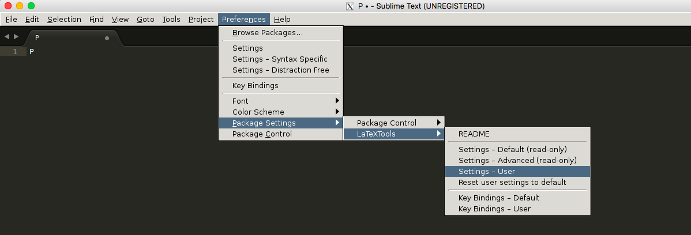

## Download and Installation 

1. Download [Sublime Tex 3](https://www.sublimetext.com/3) for your operating system.
2. Install
	+ Window/Mac: GUI install, just doubly check the file you downloaded, and follow the instructions.
	+ Ubuntu: here assume you have downloaded the **deb** installation file, open a terminal and type in the following command `sudo dpkg -i path/to/sublime_text_3_deb_file`

## Configuration

+ Manually (Semi-manually) install [Package Control](https://packagecontrol.io/installation) (Note that, Package Control is the only package that you need install manually)

``ctrl + ` `` (``command + ` `` if you use Mac) to open the console, and copy the following codes into the console and then press `enter`.

~~~shell
import urllib.request,os,hashlib; h = 'df21e130d211cfc94d9b0905775a7c0f' + '1e3d39e33b79698005270310898eea76'; pf = 'Package Control.sublime-package'; ipp = sublime.installed_packages_path(); urllib.request.install_opener( urllib.request.build_opener( urllib.request.ProxyHandler()) ); by = urllib.request.urlopen( 'http://packagecontrol.io/' + pf.replace(' ', '%20')).read(); dh = hashlib.sha256(by).hexdigest(); print('Error validating download (got %s instead of %s), please try manual install' % (dh, h)) if dh != h else open(os.path.join( ipp, pf), 'wb' ).write(by)
~~~

+ Install package LatexTools

	- `ctrl + shift + p` (`command + shift + p` if you use Mac) to open the command Platte for Package Control 
	- Find and click "Package Control: Install Package"
	- Enter "LaTexTools" to search and click on the "LaTexTools" to install  
	

+ Configuration

	- Open the configuration for LaTeXTools and "OK" for all pop-up windows.
	  
	  
	  
	- Replace the content with [this one](https://gist.github.com/xlong88/71837d9626bba76b84a09f8629796c2e)

To use the above customized configuration, you need the following tools (note that, for the latest version of Ubuntu, all tools are built-in in the OS.)

+ Ghostscript
	- [Windows](http://www.ghostscript.com/download/gsdnld.html)
	- Mac: `brew install ghostscript`
+ PDF Viewer
	- [Windows](http://www.sumatrapdfreader.org/dl/SumatraPDF-3.1.2-64-install.exe)
	- [Mac](http://skim-app.sourceforge.net/)

		

